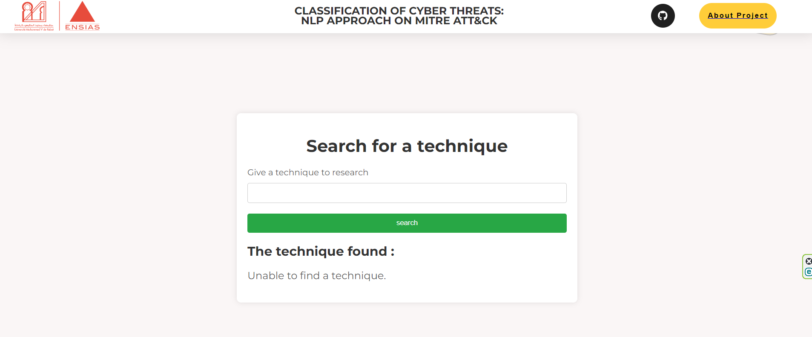

# Classification of Cyber ​​Threats: NLP approach on MITRE ATT&CK

Our end-of-year project aims to develop a methodology for classifying cyber threats using the NLP (Natural Language Processing) approach of the MITRE ATT&CK framework. By combining machine learning algorithms and transformers, the goal is to create a system capable of efficiently analyzing and categorizing various cyber threats. This approach will enable a better understanding of potential attacks, as well as a faster and more precise identification of security measures to implement.

### Project's architecture v1.0.0


### Application' Architecture  v1.3.0


### NLP Pipeline


## Directory Structure

### Data
- **Processed datasets**: Contains processed data ready for modeling.
- **Raw Data**: Contains raw data files.
- **Final.csv**: The final dataset used for training and evaluation.

## Deployment with Git

To deploy this project on Heroku using Git, follow the steps below:

1. Navigate to the deployment directory:
```sh
    cd "DEPLOYMENT"
```

2. Install Git and the Heroku CLI by following the official documentation:
Prérequis : [Prerequisites:Install Git and the Heroku CLI](https://devcenter.heroku.com/categories/command-line)

3. Add a heroku.yml file in the folder containing your project content. For more details, consult the Heroku documentation:
[Build Docker Images with heroku.yml](https://devcenter.heroku.com/articles/build-docker-images-heroku-yml)

4.Log in to your Heroku account:

```sh
    heroku login
```

5. Create a new repo on Heroku for your project:
```sh
    heroku create <Votre-nom-APP>
```

6. Configure Heroku to use Docker containers:
```sh
    heroku stack:set container

```

7. Change the default branch to main:
```sh
    git branch -M main
```

8. Stage all files and commit the changes:

9. Push the changes to Heroku, which will automatically launch the Docker Compose build:
```sh
    git push heroku main
```


Make sure all steps are followed correctly to ensure a successful deployment of your application on Heroku. If there is an error during the build, you can access the logs with:
```sh
    heroku logs --tail
```

10.tree details:


- **Model**: Directory containing the model files.
- **static/styles**: Directory for static stylesheets.
- **templates**: Directory for HTML templates.
- **Dockerfile**: Dockerfile for building the Docker image.
- **constante.py**: File containing constant definitions.
- **deploy.py**: Deployment script.
- **docker-compose.yml**: Docker Compose configuration file.
- **heroku.yml**: Heroku deployment configuration.
- **requirements.txt**: List of dependencies.
- **wsgi.py**: WSGI entry point.

### Models
- **ML Models**: Directory containing the trained machine learning model and its vectorizer.

### Notebooks
- **1. scrapping**: Contains the file used for data scrapping
- **2. data preparation.ipynb**: Jupyter notebook for data preparation steps.
- **3. NLP processing and modeling.ipynb**: Jupyter notebook for NLP processing and model training.
- **4. SecBERT.ipynb**: Jupyter notebook for experimenting with the SecBERT model.
- **5. SVC Predictions.ipynb**: Jupyter notebook for generating predictions using a Support Vector Classifier (SVC) model.
- **requirements.txt**: List of dependencies.

## Prerequisites

- Python 3.9 or higher
- `virtualenv` (if not already installed, use `pip install virtualenv`)

## Installation

1. **Clone the repository**

    ```bash
    git clone https://github.com/zacharyb02/Mitre-attack.git
    cd Mitre-attack
    ```

2. **Create a virtual environment**

    ```bash
    python -m venv env
    ```

3. **Activate the virtual environment**

    - On Windows:

        ```bash
        .\env\Scripts\activate
        ```

    - On macOS/Linux:

        ```bash
        source env/bin/activate
        ```

4. **Install the dependencies**

    ```bash
    pip install -r requirements.txt
    ```

## Launch the Notebook

1. **Ensure the virtual environment is activated** (see step 3 above).

2. **Launch Jupyter Notebook**

    ```bash
    jupyter notebook
    ```

3. **Open the notebook `2. data preparation.ipynb`**

    In the Jupyter interface, navigate to `2. data preparation.ipynb` and open it.

## Notes

- Make sure to follow these instructions in order to avoid any configuration issues.
- If you encounter any problems, verify that all dependencies are installed correctly and that the virtual environment is activated.

## Screenshot web applicationn


# Team Members
- [Nour Amellouk](https://github.com/Amellouk-Nour)
- [Zakaria Baou](https://github.com/zacharyb02)
- [Mahmoud El Hamlaoui](https://github.com/ELHAMLAOUI)
